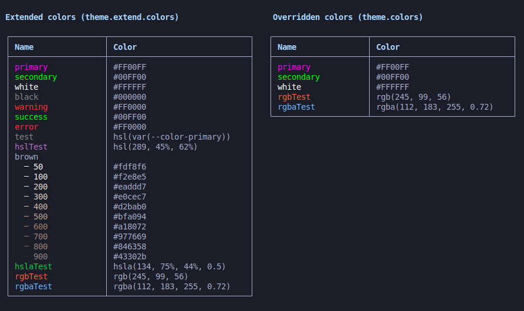
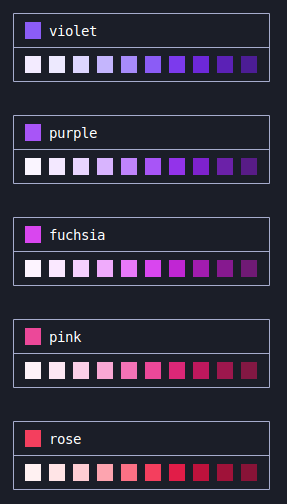
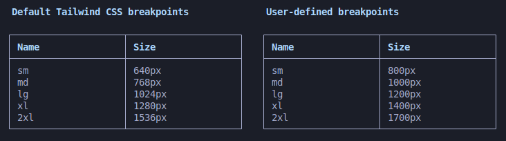
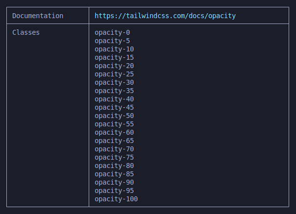

# tw-helper

## Motivation

How many times you forgot what the helper classes for line-height were, or what the default breakpoints for Tailwind are? Tw-helper is a command-line tool that provides fast, and easy to use commands retrieving information on Tailwind, so you don't have to necessarily go browse documentation and lose focus!

## Usage

```javascript
npm install tw-helper
```

```javascript
npx tw-helper
```

## Commands

### `colors` Command

The colors command allows you to list the colors on the Tailwind project.

**Syntax:**

```javascript
tw-helper colors [options]
```

**Options:**

- -d, --default:

  Use this flag to list the default color palette from Tailwind CSS.

  Example:

  ```javascript
  tw-helper colors --default
  ```

  This command will print the default set of colors provided by Tailwind CSS.

- -c, --config \<file>:

  Use this flag to provide a custom Tailwind configuration file. The file should specify custom colors used in your project. This flag is only required, if the tailwind configuration file is renamed, or relocated from the project root.

  Example:

  ```javascript
  tw-helper colors --config ./path/to/your-config.js
  ```

  This command will print the colors defined in the specified configuration file.

<br /> **Example output:**

```javascript
tw-helper colors
```

<br /> 

<br /> **Example output:**

```javascript
tw-helper colors -d
```


<br /> 

### `breakpoints` Command

The breakpoints command allows you to list the breakpoints on the Tailwind project.

<br /> **Example output:**

```javascript
tw-helper breakpoints
```

<br />  <br />

### `css` Command

The css command allows you to list the Tailwind helper classes associated for the provided css property. Also provides a link to the Tailwind documentation for the given property.

**Syntax:**

```javascript
tw-helper css <property>
```

**Property:**

- Css property to list the Tailwind classes for.

<br /> **Example output:**

```javascript
tw-helper css opacity
```

<br /> 

## License

This software is licensed under the [MIT](LICENSE)

## Contributing

All contributions are welcome, please use the [Issues tracker](https://github.com/anttiromppanen/tw-helper/issues)
